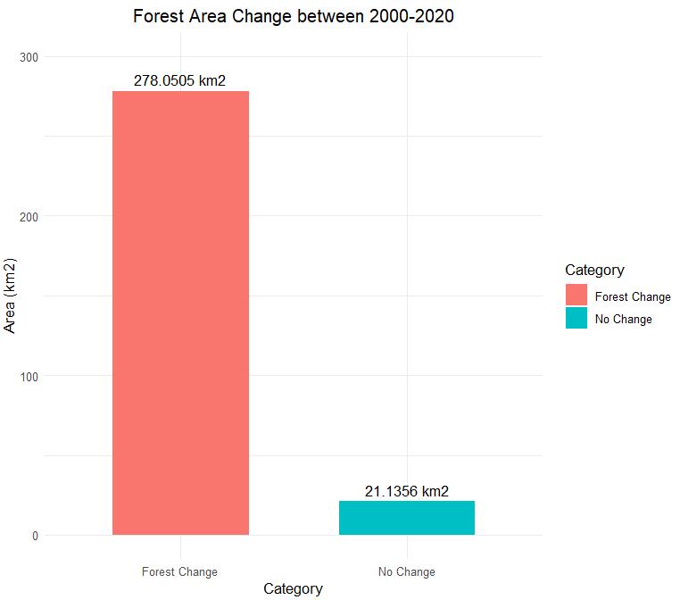

<!-- README.md is generated from README.Rmd. Please edit that file -->

# forchange

<!-- badges: start -->
<!-- badges: end -->

The goal of forchange is to calculate the decadal forest loss in a
specific area. It equips users with necessary tools to determine the
vegetation change by calculating NDVI difference between two different
timesteps and quantifying change with landscape statistics.This package
offers 3 functions to compute decadal forest change. Function formask
employs masking operation to only extract forest from a rasterstack
where users need to designate training polygons and landuse classes.
Function defndvi calculates the difference image of NDVIs’ from two
different timesteps.Such change comparison should be conducted on images
acquired of the same season or month and to observe more variation of
change more than two timesteps are ideal.forchange function simply
quantify the change by calculating the area of change and no change.

## Installation

The developed version of  forchange can be installed  from
[GitHub](https://github.com/) with:

``` r
# install.packages("devtools")
devtools::install_github("MimShara1/forchange")
```

## Example

1.This function calculates forest mask

    ## Reading data and define parameters
        ras_stack_path <- system.file("extdata", "roi_2000.tif", package="forchange")
        ras_stack <- stack(ras_stack_path)
        tr_samp_path <- system.file("extdata", "samples2000.gpkg", package = "forchange")
        tr_samp <- st_read(tr_samp_path)
        bandnames <- c("B01", "B02", "B03", "B04", "B05", "B06", "B07")

        #Calculating the forest mask
        formask(ras_stack,bandnames,tr_samp)

<figure>

<figcaption aria-hidden="true">forest mask</figcaption>
</figure>


2 This function calculates the NDVI difference


         ras_stack_path <- system.file("extdata", "roi_2000.tif", package="forchange")
         ras_stack <- stack(ras_stack_path)

         tr_samp_path <- system.file("extdata", "samples2000.gpkg", package = "forchange")
         tr_samp <- st_read(tr_samp_path)

         bandnames <- c("B01", "B02", "B03", "B04", "B05", "B06", "B07")


         t1_nir_path <- system.file("extdata", "l5_nir.tif", package="forchange")
         t1_nir <- raster(t1_nir_path)

         t1_red_path <- system.file("extdata", "l5_red.tif", package="forchange")
         t1_red <- raster(t1_red_path)


         t2_nir_path <- system.file("extdata", "l8_nir.tif", package="forchange")
         t2_nir <- raster(t2_nir_path)

         t2_red_path <- system.file("extdata", "l8_red.tif", package="forchange")
         t2_red <- raster(t2_red_path)

         mask <- formask(ras_stack,bandnames,tr_samp)


         #Calculating the NDVI difference
         d_ndvi <- defndvi(t1_nir, t1_red, t2_nir, t2_red, mask)
         hist(d_ndvi,col="tan", border="white",xlab = "NDVI Difference",
         ylab = "Frequency", xlim = c(-1, 1),ylim = c(0, 15000))``

\`\`\`\` 


 3.This function quantify the change using landscape statistics


t1_nir_path \<- system.file(“extdata”, “l5_nir.tif”,
package=“forchange”) t1_nir \<- raster(t1_nir_path)

t1_red_path \<- system.file(“extdata”, “l5_red.tif”,
package=“forchange”) t1_red \<- raster(t1_red_path)

t2_nir_path \<- system.file(“extdata”, “l8_nir.tif”,
package=“forchange”) t2_nir \<- raster(t2_nir_path)

t2_red_path \<- system.file(“extdata”, “l8_red.tif”,
package=“forchange”) t2_red \<- raster(t2_red_path) mask \<-
formask(ras_stack,bandnames,tr_samp)

defndvi(t1_nir, t1_red, t2_nir, t2_red, mask)

def_NDVI \<- defndvi(t1_nir, t1_red, t2_nir, t2_red, mask) threshold \<-
-0.2
forchange(def_NDVI, threshold)


<figure>

<figcaption aria-hidden="true">forest change</figcaption>
</figure>

\`\`\` In that case, don’t forget to commit and push the resulting
figure files, so they display on GitHub and CRAN.
