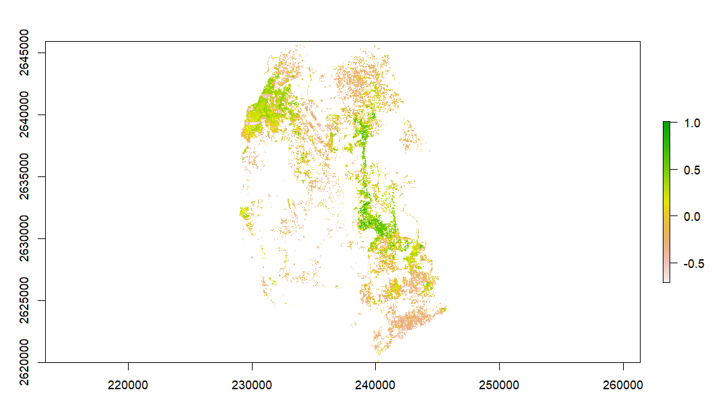

# forchange

<!-- badges: start -->
<!-- badges: end -->

forchange is a R package designed to calculate the forest loss for monitoring the changes in forest cover between two different timesteps, typically spanning a decade.

## Installation

The developed version of  forchange can be installed  from
[GitHub](https://github.com/) with:

``` r
# install.packages("devtools")
devtools::install_github("MimShara1/forchange")

```
## Functions


This package employs 3 functions to examine the forest cover change between two timesteps. 

formask: Creates a binary raster of forest mask assigning forest class value in a landuse classified raster

diff_ndvi: Creates a single layer raster representing ndvi difference between two timesteps

forchange: Calculates the forest loss using landscape statistics


## Example


Here are few examples how this package works. In this example we have used Landsat 5 and Landsat 8 sensor data for two different timesteps. For first timestep (2000) we have used Landsat 5 and for second timestep (2020) we have used Landsat 8. 

Part I: This is the example of formask function. Inside of  this function we have a raster stack where we assign a vector character to assign the band names to available bands. from this stack we first extract landuse classification raster and later from the newly created raster we extract forest mask by assigning forest class value for masking the forest. For the landuse classification we also used a vector file containing training polygons.The training polygons needs to be created manually as we do not have ground truth data. The training polygons have been created in QGIS and reprojected same as the raster stack. Simple yet crucial operation for further workflow. The stack  and reprojection has been performed in QGIS but users can also conduct this in R using "stack" function from "raster" package  for stack and spTransform for "reprojection" from "sp" package.


```
  library(raster)
  library(sp)
  library(sf)
  library(RStoolbox)
  library(caret)
  library(randomForest)
  library(terra)


    ## Read data and define parameters
        ras_stack_path <- system.file("extdata", "roi_2000.tif", package="forchange")
        ras_stack <- stack(ras_stack_path)
        tr_samp_path <- system.file("extdata", "samples2000.gpkg", package = "forchange")
        tr_samp <- st_read(tr_samp_path)
        bandnames <- c("B01", "B02", "B03", "B04", "B05", "B06", "B07")

        #Calculate the forest mask
        formask(ras_stack,bandnames,tr_samp)


```


Part II: diff_ndvi function calculates the NDVI using NIR and red bands from two different timesteps. The workflow employs "overlay" function from "raster" to overlay the NDVIs' over forest mask so that NDVI values only for forested areas can be extracted.Then the function simply get the difference of two NDVI images. An  important aspect of such change analysis is that it should be conducted on images acquired of the same season or month. In addition,For determination of  more variation of change in the analysis more than two timesteps are ideal.


```
 #Load data
 t1_nir_path <- system.file("extdata", "l5_nir.tif", package="forchange")
 t1_nir <- raster(t1_nir_path)

 t1_red_path <- system.file("extdata", "l5_red.tif", package="forchange")
 t1_red <- raster(t1_red_path)


 t2_nir_path <- system.file("extdata", "l8_nir.tif", package="forchange")
 t2_nir <- raster(t2_nir_path)

 t2_red_path <- system.file("extdata", "l8_red.tif", package="forchange")
 t2_red <- raster(t2_red_path)
 
 mask_path <- system.file("extdata", "forest_mask.tif", package="forchange")
 mask<- raster(mask_path)
 
 
 #Calculate the difference of NDVI 
 diff_ndvi(t1_nir, t1_red, t2_nir, t2_red, mask)
 
 #Plot data
 d_ndvi <- diff_ndvi(t1_nir, t1_red, t2_nir, t2_red, mask)
 plot(d_ndvi)
 
```


 


```

 3.This function quantify the change using landscape statistics


 t1_nir_path <- system.file("extdata", "l5_nir.tif", package="forchange")
 t1_nir <- raster(t1_nir_path)

 t1_red_path <- system.file("extdata", "l5_red.tif", package="forchange")
 t1_red <- raster(t1_red_path)


 t2_nir_path <- system.file("extdata", "l8_nir.tif", package="forchange")
 t2_nir <- raster(t2_nir_path)

 t2_red_path <- system.file("extdata", "l8_red.tif", package="forchange")
 t2_red <- raster(t2_red_path)

 mask_path <- system.file("extdata", "forest_mask.tif", package="forchange")
 mask<- raster(mask_path)

 diff_ndvi(t1_nir, t1_red, t2_nir, t2_red, mask)
 
 diff_NDVI <- diff_ndvi(t1_nir, t1_red, t2_nir, t2_red, mask)

 threshold <- -0.2


 forchange(diff_NDVI, threshold)

```


